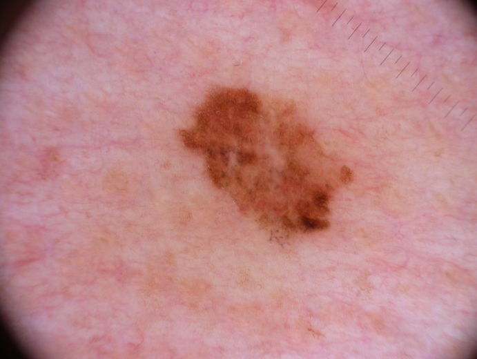
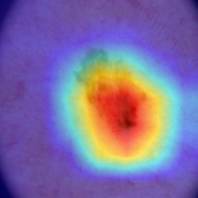
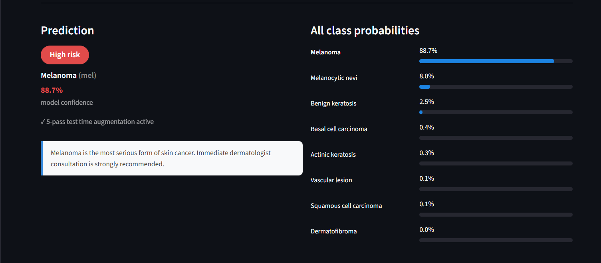
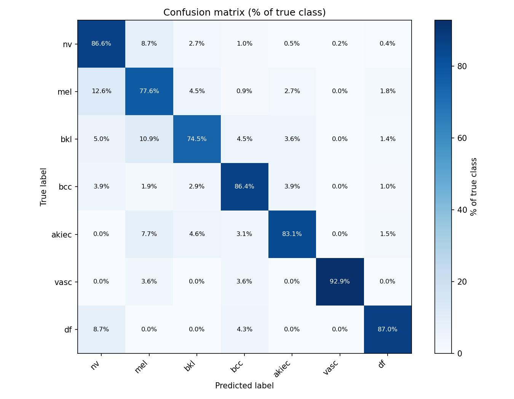
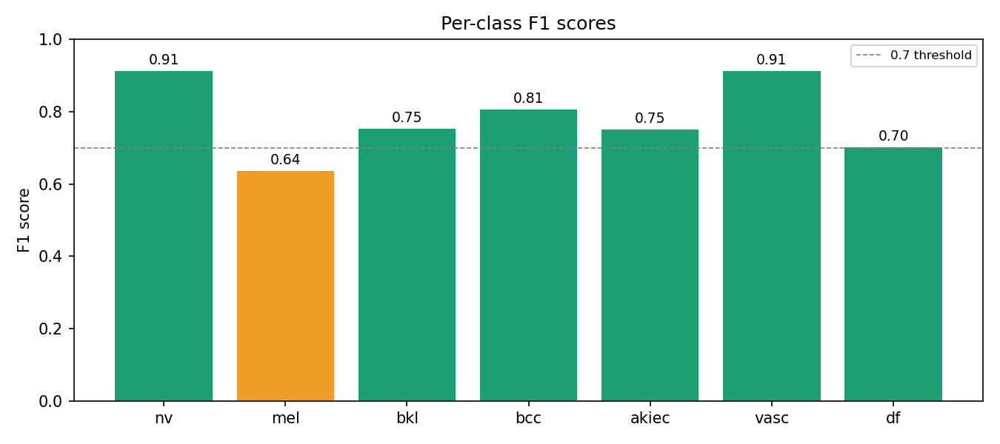
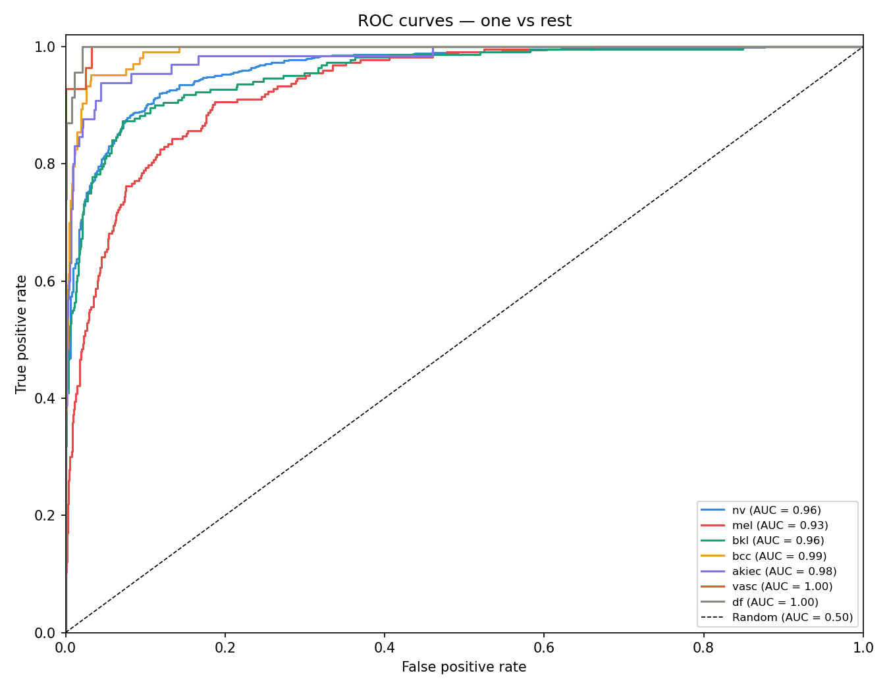
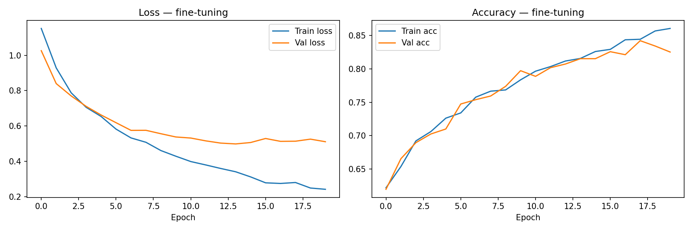

# 🔬 Skin Lesion Risk Classifier

A deep learning web application that classifies dermoscopy images into 8 skin lesion categories with visual explainability via Grad-CAM heatmaps.

Built by **Arfaoui Seif** as a portfolio project combining computer vision, transfer learning, and medical AI.

---

## 📸 Demo

| Original Image | Grad-CAM Heatmap | Prediction |
|:-:|:-:|:-:|
|  |  | Melanoma — 88.7% |

> Upload a dermoscopy image → get a risk classification + visual explanation of what the model focused on.

---

## 🧠 Model

| Property | Details |
|---|---|
| Architecture | ResNet50 |
| Pretraining | ImageNet (IMAGENET1K_V1) |
| Training strategy | Two-phase: frozen backbone → full fine-tuning |
| Dataset | ISIC 2019 (25,331 dermoscopy images) |
| Classes | 8 skin lesion types |
| Val accuracy | **81.41%** |
| Macro F1 | **0.76** |
| Weighted F1 | **0.81** |
| Explainability | Grad-CAM on last convolutional layer |
| Inference | 5-pass Test Time Augmentation (TTA) |

---

## 🗂️ Detectable Conditions

| Code | Condition | Risk Level |
|---|---|---|
| `mel` | Melanoma | 🔴 High risk |
| `nv` | Melanocytic nevi | 🟢 Benign |
| `bcc` | Basal cell carcinoma | 🔴 High risk |
| `scc` | Squamous cell carcinoma | 🔴 High risk |
| `ak` | Actinic keratosis | 🟡 Moderate risk |
| `bkl` | Benign keratosis | 🟢 Benign |
| `vasc` | Vascular lesion | 🟢 Benign |
| `df` | Dermatofibroma | 🟢 Benign |

---

## 📊 Results

### Per-class performance (ISIC 2019 val set)

| Class | Precision | Recall | F1 |
|---|---|---|---|
| nv | 0.89 | 0.88 | 0.88 |
| vasc | 0.93 | 0.84 | 0.89 |
| bcc | 0.81 | 0.89 | 0.85 |
| ak | 0.71 | 0.72 | 0.71 |
| bkl | 0.71 | 0.70 | 0.71 |
| df | 0.76 | 0.67 | 0.71 |
| mel | 0.70 | 0.70 | 0.70 |
| scc | 0.70 | 0.58 | 0.63 |

### Training progression

| Phase | Strategy | Best val accuracy |
|---|---|---|
| Local phase 1 | Frozen backbone, head only | 61.4% |
| Local phase 2 | Full fine-tuning | **84.2%** |
| Kaggle phase 1 | Frozen backbone, head only | 54.2% |
| Kaggle phase 2 | Full fine-tuning, 25k images | **81.4%** |

---

## 🏗️ Architecture

```
Input image (224×224×3)
        ↓
   ResNet50 backbone
   (pretrained on ImageNet)
   49 convolutional layers
        ↓
   Global average pooling
        ↓
   Dropout (p=0.4)
        ↓
   Linear (2048 → 8)
        ↓
   Softmax → class probabilities
        ↓
   Grad-CAM ← layer4[-1]
```

---

## ⚙️ Training Details

### Dataset
- **Local development**: HAM10000 — 10,015 images, 7 classes
- **Full training**: ISIC 2019 — 25,331 images, 8 classes
- **Split**: 80% train / 20% val (stratified)

### Handling class imbalance
The dataset is heavily imbalanced (`nv` = 50.8% of samples). We used inverse-frequency class weights in the cross-entropy loss function, giving rare classes up to 58x more weight than common ones.

### Two-phase training strategy
```
Phase 1 — freeze backbone, train head only
  Optimizer : Adam  |  LR : 1e-4  |  Epochs : 10
  Purpose   : stabilize the new classification head
              before touching pretrained weights

Phase 2 — unfreeze all layers, full fine-tuning
  Optimizer : Adam  |  LR : 1e-5  |  Epochs : 25
  Purpose   : gently nudge all 23M parameters
              toward skin lesion features
```

### Augmentation
```python
RandomHorizontalFlip()
RandomVerticalFlip()
RandomRotation(20)
ColorJitter(brightness=0.2, contrast=0.2, saturation=0.2)
Normalize(mean=[0.485, 0.456, 0.406], std=[0.229, 0.224, 0.225])
```

### Test Time Augmentation (TTA)
At inference, the model runs 5 passes per image with different augmentations (original, h-flip, v-flip, rotation, center crop) and averages the probabilities. This reduces prediction variance on ambiguous cases with no retraining required.

---

## 🗃️ Project Structure

```
skin-lesion-classifier/
│
├── app.py                  # Streamlit web application
├── data.py      # Dataset class, transforms, data pipeline
├── train.py           # Phase 1 training (frozen backbone)
├── fine_tune.py        # Phase 2 fine-tuning (full model)
├── gradcam.py         # Grad-CAM heatmap generation
├── evaluate.py        # Confusion matrix, F1, ROC curves
├── inference.py       # Inference pipeline with TTA
├── kaggle_notebook.py      # Full training script for Kaggle
│
├── assets/
│   ├── class_distribution.png
│   ├── training_curves.png
│   ├── finetuning_curves.png
│   ├── confusion_matrix.png
│   ├── f1_scores.png
│   ├── roc_curves.png
│   └── gradcam_results.png
│
└── requirements.txt
```

---

## 🚀 Run Locally

### 1. Clone the repo
```bash
git clone https://github.com/arfaouiseif/skin-lesion-classifier
cd skin-lesion-classifier
```

### 2. Install dependencies
```bash
pip install torch torchvision streamlit grad-cam pillow numpy scikit-learn pandas matplotlib
```

### 3. Download model weights
Download `best_model_isic2019.pth` from the [releases page](https://github.com/arfaouiseif/skin-lesion-classifier/releases) and place it in the project root.

### 4. Run the app
```bash
streamlit run app.py
```

Open `http://localhost:8501` in your browser and upload a dermoscopy image.

> ⚠️ This app requires **dermoscopy images** — standard photos will not produce reliable results. You can find test images at [isic-archive.com](https://www.isic-archive.com/).

---
## 🔍 Evaluation Visuals

### Confusion matrix


### Per-class F1 scores


### ROC curves


### Training curves

## 📦 Requirements

```
torch
torchvision
streamlit
grad-cam
pillow
numpy
scikit-learn
pandas
matplotlib
```

---

## ⚠️ Medical Disclaimer

This tool is for **educational and research purposes only**. It does not constitute medical advice, diagnosis, or treatment. Always consult a qualified dermatologist for any concerns about skin lesions. Never delay seeking medical advice based on this application.

---

## 📚 Dataset & References

- **ISIC 2019**: Tschandl P. et al. *The HAM10000 dataset.* Scientific Data, 2018
- **HAM10000**: Codella N. et al. *Skin Lesion Analysis Toward Melanoma Detection*, ISIC 2019
- **Grad-CAM**: Selvaraju R. et al. *Grad-CAM: Visual Explanations from Deep Networks*, ICCV 2017
- **ResNet**: He K. et al. *Deep Residual Learning for Image Recognition*, CVPR 2016

---

## 👤 Author

**Arfaoui Seif Eddine**

Student Engineer in ICT

Built with ❤️ for learning systems.
- GitHub: [@arfaouiseif](https://github.com/arfaouiseif)

---

*Built with PyTorch, Streamlit, and the ISIC Archive.*
